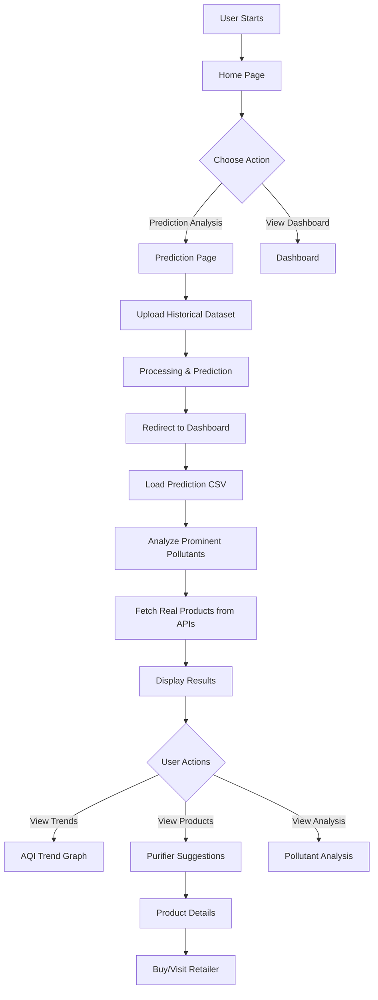
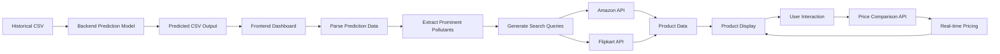
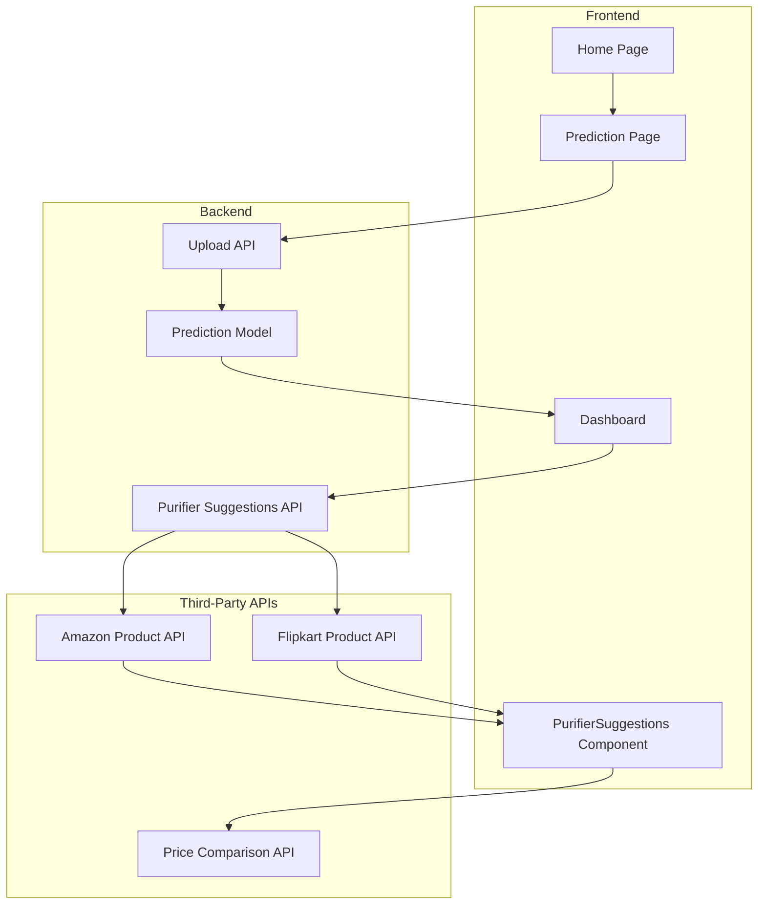

# AQI Prediction System - User Flow & Data Flow Documentation

## User Flow Diagram



## Data Flow Diagram



## System Architecture Flow



## Detailed Process Flow

### 1. Data Upload & Prediction Flow
1. **User uploads historical CSV** → Prediction page
2. **Backend processes file** → Python prediction model
3. **Model generates predictions** → Future AQI values
4. **Saves predicted CSV** → Backend storage
5. **Redirects to dashboard** → With prediction data

### 2. Pollutant Analysis Flow
1. **Dashboard loads prediction CSV** → Parse data
2. **Extract prominent pollutants** → Count frequencies
3. **Identify top 5 pollutants** → By occurrence percentage
4. **Generate search queries** → Based on pollutant types
5. **Call external APIs** → For each pollutant

### 3. Product Search Flow
1. **Dynamic query generation** → Based on pollutant
2. **Amazon API call** → Search products
3. **Flipkart API call** → Search products
4. **Parse product data** → Extract details
5. **Benefit extraction** → From descriptions
6. **Combine results** → Unified product list

### 4. Real-time Pricing Flow
1. **User clicks product** → Get product ID
2. **Price API call** → Based on retailer
3. **Current pricing** → Real-time data
4. **Display pricing** → With discounts
5. **Update UI** → Live price updates

## API Integration Details

### External API Endpoints
- **Amazon Product Search**: `https://amazon-product-search-api.p.rapidapi.com/search`
- **Flipkart Product Search**: `https://flipkart-api.p.rapidapi.com/search`
- **Price Comparison**: `https://price-comparison-api.p.rapidapi.com/price`

### Dynamic Query Generation
```javascript
// Example for PM2.5
const query = "PM2.5 air purifier HEPA filter removal";

// Example for NO2
const query = "NO2 gas removal air purifier activated carbon";
```

### Response Processing
```javascript
// Product data structure
{
  id: "amazon-asin123",
  name: "Philips Series 2000i",
  cost: "₹12,999",
  benefits: "HEPA filtration, Smart controls",
  image: "product-image-url",
  link: "amazon-product-url",
  retailer: "Amazon",
  rating: 4.3,
  pollutant: "PM2.5",
  searchQuery: "PM2.5 air purifier HEPA filter removal"
}
```

## Error Handling Flow

1. **API Failure** → Fallback to cached data
2. **No Products Found** → Show alternative suggestions
3. **Price API Error** → Display original price
4. **Network Issues** → Show offline mode
5. **Invalid Data** → Error message with retry option

## Performance Optimization

1. **Parallel API Calls** → Promise.all() for multiple retailers
2. **Caching Strategy** → Cache product data for 24 hours
3. **Lazy Loading** → Load products on demand
4. **Debounced Search** → Prevent excessive API calls
5. **Image Optimization** → Compress product images

## Security Considerations

1. **API Key Management** → Environment variables
2. **CORS Configuration** → Backend proxy if needed
3. **Input Validation** → Sanitize search queries
4. **Rate Limiting** → Prevent API abuse
5. **Data Privacy** → No personal data stored

## User Experience Flow

1. **Loading States** → Show progress indicators
2. **Error Messages** → Clear, actionable feedback
3. **Empty States** → Helpful when no products found
4. **Responsive Design** → Mobile-friendly interface
5. **Accessibility** → Screen reader support

## Testing Strategy

1. **Unit Tests** → Individual API functions
2. **Integration Tests** → API responses
3. **E2E Tests** → Complete user flows
4. **Mock APIs** → Development testing
5. **Load Testing** → API performance

This documentation provides a comprehensive overview of the dynamic AQI prediction system with real-time product recommendations from third-party APIs.
